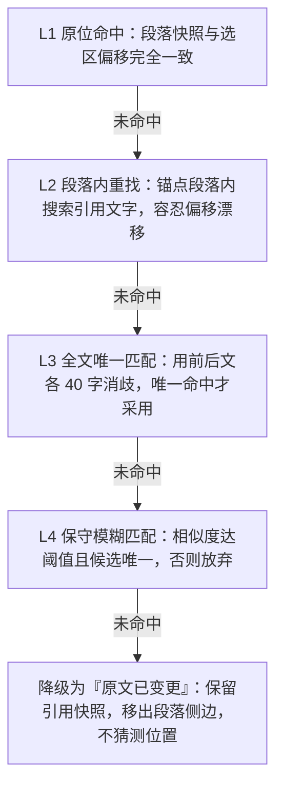

# 帖子划线与段落想法：作者编辑后的锚点失效分析

结论先行：**不需要锁住编辑**。用锁编辑来换锚点稳定，是拿产品能力去换实现上的省事，代价不成比例--作者改个错别字这种最常见的编辑会被一起挡掉。正确的做法是让锚点可降级，并且区分「私人划线」和「公开想法」两种失效处置。

## 一、先纠正一个前提

当前实现其实已经不怕编辑。`packages/web/lib/highlight-dom.ts` 的定位主键是 `selectedText`，`startOffset` 和 `endOffset` 在渲染时并未参与定位，只在 `Highlight` 表的唯一索引里用于去重。因此「作者一改就全体错位」这个最坏情况不会发生：句子没被改动的划线仍然能正确挂上，句子被改写或删除的划线则自然消失。

## 二、现有的真实缺口

`anchor` 取的是段落前 40 字（`ANCHOR_LEN = 40`）。作者只要改动段首，`anchor` 就失配，第一层定位直接落空，被迫退到全文搜索。而全文搜索在 `locate()` 里遇到重复文本是 `count > 1` 就 `return null`--像「我认为」「这一点很重要」这类短选区，会在原文完全没被改动的情况下整条消失。这是当前最容易踩到的缺陷，与编辑行为无关。

其余几项：没有 `prefix` / `suffix` 上下文用于消歧；`Highlight` 模型缺少 PRD 第 8 节要求的 `paragraph_snapshot` 和 `anchor_status`；缺少全半角与空白归一化；`UpdatePost` 只是覆盖 `content`，对存量锚点不做任何处理。

## 三、锚点解析阶梯

补齐方式是把定位改成逐层降级。选区存储建议采用 W3C Web Annotation Data Model 的 TextQuoteSelector 形态，即 `exact` 加 `prefix`、`suffix` 三件套，这是标准中专门为「目标文档会变」设计的选择器。`anchor` 建议从「前 40 字」换成归一化段落文本的 hash，与 `paragraph_snapshot` 一并存储。第三层有了前后文消歧，重复文本就不必整条放弃。

## 四、划线与想法必须分开处置

这是整件事的关键。两者不能共用同一套失效策略，因为它们的数据性质完全不同。

| 维度 | 私人划线 Highlight | 公开想法 Annotation |
|-|-|-|
| 归属 | 仅本人可见 | UGC，带回复和点赞 |
| 匹配不上时 | 前端静默不渲染，可接受 | 绝不能静默消失 |
| 状态字段 | 不需要持久化 | 必须有 anchor_status |
| 计算位置 | 客户端即时解析 | 服务端 reconcile 后落库 |

划线丢一条，用户最多觉得奇怪。想法丢一条，丢的是别人写的正文加整条回复线程，这是数据事故。所以想法必须落 `attached` / `orphaned` 状态，失效后从段落侧边移出、但保留在帖子级「本文想法」列表里，并带上创建时的引用快照--这正是 PRD 6.7 已经写明的兜底，实现时不要漏掉最后半句「系统不得静默把想法挂到相似但不确定的段落」。宁可显示「原文已变更」，也不要挂错段落，挂错比消失更伤害信任。

## 五、落地要注意的两点

**服务端要能切段落。**想法的 `anchor_status` 需要在 `UpdatePost` 里同步重算，这意味着 Go 侧需要一份 Markdown 到段落纯文本的提取逻辑，而且分块口径必须与前端 `MarkdownRenderer` 严格一致：`p`、`h1` 至 `h6`、`li`、`blockquote` 参与，`pre` 和 `code` 跳过。这两处口径一旦漂移，锚点会大面积失配，是本方案最主要的工程风险，建议把切分规则连同用例固化成测试。顺带给 `Post` 增加 `content_digest`，归一化后内容没变就整段跳过重算。

**把决定权交还作者。**保存前先做一次 dry-run，返回「本次修改将使 N 条读者想法失去原文位置」，让作者知情后再决定。这比事后静默失效体面得多，也比锁编辑温和。

如果确实想给「锁」留个位置，合理的粒度是让作者对单篇文章关闭段落想法（默认开启），而不是反过来用锁编辑去换锚点稳定。
